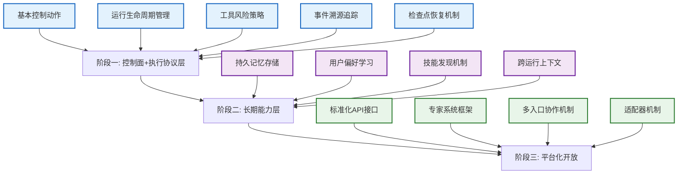

# Idea Factory 实施路线图

> 版本：v0.3-target
> 日期：2026-04-19
> 状态：三层架构验证导向的实施计划

## 🎯 总体策略

Idea Factory 的实施遵循三层架构验证方法：
1. **阶段一**：控制面与执行协议层定型 - 建立基本可治理、可追溯的探索系统
2. **阶段二**：长期能力层验证 - 验证系统能够学习和积累能力
3. **阶段三**：平台化开放 - 开放扩展能力供专家系统和多入口协作

每个阶段都有明确的验证标志，确保在进入下一阶段前当前层次的架构原则得到充分验证。

## 📅 阶段一：控制面与执行协议层定型（当前阶段）

### 目标
建立基本的用户治理入口和安全可追溯的执行协议，使系统能够在用户控制下进行基本的探索操作。

### 关键组件
- **控制面 (L1)**
  - 基础控制台：探索/暂停/继续/重定向控制动作
  - 运行状态可视化：当前run/turn状态、等待原因
  - 基础控制动作反馈机制：已接收/已吸收/已反映/后续影响
  
- **执行协议层 (L2)**
  - Run/Turn/Checkpoint 协议实现
  - 基础工具风险策略：简单的允许/拒绝机制
  - 事件溯源系统：基本的工具调用和控制动作追踪
  - 检查点与恢复机制：从最近一致状态恢复

### 验证标志
- [ ] 用户可以通过控制台启动、暂停、继续探索会话
- [ ] 所有用户控制动作都能得到明确的四类反馈（已接收/已吸收/已反映/后续影响）
- [ ] 系统能够从检查点正确恢复运行状态
- [ ] 所有工具调用和图谱修改都有不可变的事件记录
- [ ] 中断后系统能够从最近检查点恢复并继续之前的探索

### 交付物
- 基础工作空间API
- 控制平面实现（结构化控制动作处理）
- 运行协调器（run/turn/checkpoint生命周期管理）
- 基础工具表策略（简单允许/拒绝）
- 图谱集成管道（基本追加操作）
- 投影构建器（基本只读视图）
- 前端控制台原型（探索控制基本功能）

## 📅 阶段二：长期能力层验证

### 目标
验证系统能够跨运行积累知识和能力，使探索会话不会表现得像每次都是第一次运行。

### 关键组件
- **长期能力层 (L3)**
  - 工作空间记忆服务：历史运行结论的持久化存储
  - 用户偏好记忆：学习和存储用户在特定工作空间中的行为模式
  - 技能绑定服务：发现、装载和追踪探索技能
  - 跨运行上下文维护：在工作空间间传递学习结果

### 验证标志
- [ ] 系统能够在多次运行间保持和复用工作空间记忆
- [ ] 用户在工作空间中的反馈和偏好能够影响后续运行行为
- [ ] 常用的探索模式能够自动沉淀为技能并在相关任务中被装载
- [ ] 系统表现出“越跑越懂当前主题”的能力，而不是每次都像第一次运行
- [ ] 长期记忆能够明确归因到特定的运行或用户动作

### 交付物
- 记忆服务实现（工作空间记忆和用户偏好记忆）
- 技能绑定服务（技能发现、绑定和版本控制）
- 跨运行上下文机制（异步预取和上下文压缩）
- 记忆和技能的持久化存储
- 前端增强（记忆和技能可视化）

## 📅 阶段三：平台化开放

### 目标
将 Idea Factory 开放为可扩展的平台，支持专家系统、多入口协作和第三方集成。

### 关键组件
- **平台扩展能力**
  - API/SDK 开放：标准化的集成接口
  - 专家系统支持：受控的专业代理协作
  - 多入口协作：不同用户和系统的协同工作
  - 适配器机制：第三方工具和服务的集成

### 验证标志
- [ ] 外部系统能够通过标准API与 Idea Factory 集成
- [ ] 专家代理能够在受控边界内协作完成复杂任务
- [ ] 多用户能够在同一个工作空间上协同工作
- [ ] 第三方工具和服务能够通过适配器机制集成
- [ ] 系统在开放扩展后仍然保持三层架构的完整性

### 交付物
- 完整的RESTful API和WebSocket接口
- SDK（支持多种语言的客户端库）
- 专家系统框架（受控的代理协作环境）
- 多入口协作机制（冲突解决和状态同步）
- 适配器开发文档和示例

## 🔄 阶段之间的依赖关系

## 📈 成功指标

### 阶段一成功指标
- 控制动作响应时间 < 500ms
- 事件追溯完整性 100%（所有高影响动作都有记录）
- 检查点恢复成功率 > 99%
- 用户对控制反馈的满意度（目标：4.0/5.0）

### 阶段二成功指标
- 长期记忆保留率 > 95%（跨系统重启）
- 用户偏好预测准确率 > 80%
- 技能复用率提升 > 50%（相同类型任务）
- 跨运行上下文传递延迟 < 2s

### 阶段三成功指标
- API响应时间 < 200ms（95%请求）
- 第三方集成数量 > 5种不同服务
- 专家系统协作成功率 > 90%
- 多用户协作冲突解决时间 < 5s

## 🛡️ 风险缓解措施

### 架构完整性风险
- **风险**：在实施过程中各层职责边界变得模糊
- **缓解**：定期架构评审，使用领域驱动设计原则保持层间清晰接口
- **监控**：每个组件只依赖其直接下层的明确定义接口

### 性能风险
- **风险**：三层架构引入额外的延迟
- **缓解**：异步处理和批量操作优化，关键路径性能预算
- **监控**：端到端延迟监控，每层预算不超过总延迟的30%

### 可用性风险
- **风险**：复杂架构导致系统不可用
- **缓解**：渐进式交付，每个阶段都有可工作的最小系统
- **监控**：可用性 SLA > 99.9%，故障恢复时间 < 30s

## 📚 参考实践

本路线图结合了以下参考系统的成功经验：

### 从 Claude Code 借鉴
- 控制面的渐进式暴露：从基本命令开始，逐步添加高级控制功能
- 明确的反馈机制：每个控制动作都提供明确的确认和效果说明
- 会话管理的重要性：强调从检查点恢复和会话历史的价值

### 从 Codex 借鉴
- 执行协议的严格性：从简单的允许/拒绝开始，逐步完善风险策略
- 事件溯源的完整性：确保所有高影响动作都有不可变记录
- 检查点机制的可靠性：重点验证从任意一致状态的恢复能力

### 从 Hermes Agent 借鉴
- 长期能力的价值：强调持久记忆和技能系统对用户体验的影响
- 用户建模的重要性：验证系统能够真正学习用户偏好而不仅仅是存储
- 技能系统的实用性：专注于能够实际提升重复任务效率的技能

## ✅ 下一步行动

1. **立即**（本周）：完成阶段一的基本控制面和执行协议层组件
2. **短期**（2-4周）：实现阶段一验证标志，进行内部测试和反馈
3. **中期**（1-2月）：进入阶段二，开发长期能力层组件
4. **长期**（3-6月）：完成阶段二验证，开始阶段三平台化开放工作

每个里程碑都应包括：
- 架构评审确保层间职责清晰
- 性能基线建立和监控
- 用户可用性测试和反馈收集
- 文档更新和知识传递
