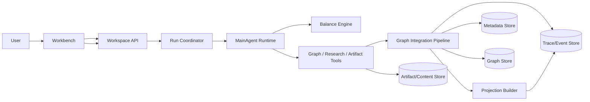

# Idea Factory 系统架构设计文档（Target State）

> 版本：v1-target
> 日期：2026-03-18
> 状态：目标态系统架构规范

## 1. 文档职责与边界

本文件定义系统层问题：

- 子系统职责边界与调用关系
- 数据面与一致性模型
- 非功能要求与运行约束
- 工程拆分与演进路径

本文件不定义：

- 产品交互目标（见产品设计）
- 领域状态机细节与业务规则（见技术设计）

## 2. 系统上下文

## 3. 子系统职责边界

| 子系统 | 输入 | 输出 | 负责 | 不负责 |
| --- | --- | --- | --- | --- |
| Workspace API | 用户请求、权限、预算 | workspace/run/intervention API 响应 | 顶层业务契约与鉴权 | 内部 graph 生长决策 |
| Run Coordinator | 启动信号、intervention、调度事件 | run 生命周期驱动 | run 创建、状态推进、恢复入口 | 决定新增哪些节点边 |
| MainAgent Runtime | workspace/graph/balance/recent mutations 摘要 | 工具调用 | graph 生长、graph 优化、研究/产出策略决策 | 绕过工具直接写库 |
| Balance Engine | 历史轨迹、当前图信号 | balance 建议 | 节奏调节策略 | 直接生成 graph mutation |
| Tool Surface | Agent 工具调用请求 | 结构化工具结果 | 参数解码、权限边界、结果标准化 | 替 Agent 做 graph 策略判断 |
| Graph Integration Pipeline | `append_graph_batch` 等结构化请求 | graph delta、mutation、持久化结果 | 最小校验、事务提交、事件生成、广播 | 自主决定 graph 生长方向 |
| Projection Builder | graph delta、metadata、trace | projection/event | 只读投影构建与推送 | 反向修改 graph |

说明：

- 当前目标态不依赖 `Task Dispatcher + SubAgents` 才能完成 graph 生长。
- 后续如需引入专用研究或物化 Agent，也必须由 `MainAgent` 驱动，并继续通过统一工具面落地结果。

## 4. 数据职责与一致性

| 数据面 | 保存内容 | 写入者 | 一致性要求 |
| --- | --- | --- | --- |
| Metadata | workspace/run/intervention、最小运行摘要 | API + Runtime | 状态转移必须单调可追溯 |
| Graph | direction / evidence / claim / decision / unknown / artifact 节点；supports / contradicts / branches_from / competes_with / raises / resolves / justifies / produces 边 | Graph Integration Pipeline | 只接受结构化批量追加 |
| Trace/Event | run 事件、tool 调用、mutation、投影事件 | Runtime + Integration + Projection | 事件幂等、可补拉 |
| Artifact/Content | 原始资料、外部内容、物化产物 | Tool Surface / MainAgent | 保留来源映射与版本 |

一致性原则：

- `Graph` 与 `Metadata` 通过 run 边界关联，避免“孤儿投影”
- `Projection` 可由 `Graph + Metadata + Trace` 重建
- 事件流采用至少一次投递，客户端基于事件 ID 去重

Graph 写入约束：

- 所有 graph 写入必须通过统一 graph tool 进入 Integration Pipeline
- 当前只允许追加，不允许程序侧整图替换或硬删除
- 一次 graph tool 调用内的 nodes / edges 必须原子提交

## 5. 关键时序（系统层）

### 5.1 首次 Run

1. API 创建 workspace 并触发 run
2. Coordinator 初始化运行上下文并登记 run
3. MainAgent 读取 workspace / graph / balance / recent mutations
4. MainAgent 按需调用 `append_graph_batch` 等受控工具
5. Integration 写入 graph / runtime mutations / activity summary，Projection 刷新并推送事件

### 5.2 Intervention 触发转向

1. API 写入 intervention（`received`）
2. Coordinator 将 intervention 注入当前或下一轮 run 上下文
3. MainAgent 在后续工具调用中改变探索重心
4. Projection 输出重心变化摘要（`reflected`）

### 5.3 自动调度与恢复

1. Run 正常结束后，Coordinator 根据 workspace 状态与策略决定是否调度下一轮
2. 暂停状态阻止下一轮调度，但不强杀当前 run
3. 服务重启后，active workspace 恢复调度能力，由新 run 继续 graph 生长

## 6. 非功能要求

- 可追溯：任一高价值方向能回溯到 run、tool 调用与 mutation
- 可恢复：进程中断后可从最近一致状态恢复运行
- 可观测：run、tool、projection、error 四类指标必须可采集
- 失败隔离：单个 tool 调用失败不应导致整个系统不可解释
- 安全边界：模型只能通过受控工具层访问 graph、外部研究与产出能力

## 7. 工程拆分建议（按子系统）

1. Workspace API + Run Coordinator
2. MainAgent Runtime + Agent Context Assembly
3. Tool Surface + Operator Sandbox
4. Graph Integration + Mutation/Event Pipeline
5. Projection Builder + Client Sync

## 8. 与技术文档和接口文档的关系

- 状态机、领域语义、graph mutation 语义：见技术设计
- 具体 HTTP schema 与错误码：见 OpenAPI

引用：

- [idea-factory-technical-design.md](./idea-factory-technical-design.md)
- [idea-factory-openapi.yaml](./idea-factory-openapi.yaml)

## 9. 一句话总结

系统架构的核心是把程序侧收敛成一个薄 runtime 外壳，让 `MainAgent` 通过统一工具面直接驱动 graph 生长，而不是在后端内核里固化 planner 和阶段策略。
