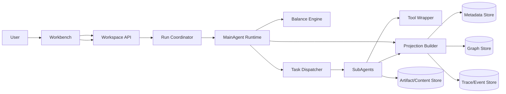

# Idea Factory 系统架构设计文档（Target State）

> 版本：v1-target
> 日期：2026-03-14
> 状态：目标态系统架构规范

## 1. 文档职责与边界

本文件定义系统层问题：

- 子系统职责边界与调用关系
- 数据面与一致性模型
- 非功能要求与运行约束
- 工程拆分与演进路径

本文件不定义：

- 产品交互目标（见产品设计）
- 领域状态机细节与业务规则（见技术设计）

## 2. 系统上下文

## 3. 子系统职责边界

| 子系统 | 输入 | 输出 | 负责 | 不负责 |
| --- | --- | --- | --- | --- |
| Workspace API | 用户请求、权限、预算 | workspace/run/intervention API 响应 | 顶层业务契约与鉴权 | 内部任务编排 |
| Run Coordinator | 启动信号、intervention | run 生命周期驱动 | run 创建、状态推进、恢复入口 | 子任务内容执行 |
| MainAgent Runtime | workspace/graph/projection 摘要 | plan、dispatch 指令、integration 结果 | 全局编排与重规划 | 工具原子调用 |
| Balance Engine | 历史轨迹、当前图信号 | balance 建议 | 节奏调节策略 | 直接写图 |
| Task Dispatcher | step 定义、agent 路由规则 | agent task | 任务切分与路由 | 全局策略决策 |
| SubAgents | task + 局部上下文 | 结构化结果 | 研究/结构化/物化执行 | 全局计划管理 |
| Tool Wrapper | 标准化工具调用请求 | 标准化结果 | 参数修复、错误归一、输出裁剪 | 业务语义判断 |
| Projection Builder | integration 结果、graph delta | projection/event | 只读投影构建与推送 | 反向修改任务状态 |

## 4. 数据职责与一致性

| 数据面 | 保存内容 | 写入者 | 一致性要求 |
| --- | --- | --- | --- |
| Metadata | workspace/run/plan/task/intervention | API + Runtime | 状态转移必须单调可追溯 |
| Graph | direction/edge/evidence/decision | Integration Pipeline | 只接受结构化 mutation 批次 |
| Trace/Event | 调度事件、失败原因、投影事件 | Runtime + Projection | 事件幂等、可补拉 |
| Artifact/Content | 原始资料、产物内容 | SubAgents | 保留来源映射与版本 |

一致性原则：

- `Graph` 与 `Metadata` 通过 run 事务边界关联，避免“孤儿投影”
- `Projection` 可由 `Graph + Metadata + Trace` 重建
- 事件流采用至少一次投递，客户端基于事件 ID 去重

## 5. 关键时序（系统层）

### 5.1 首次 Run

1. API 创建 workspace 并触发 run
2. Coordinator 初始化运行上下文并登记 run
3. MainAgent 生成 plan，Dispatcher 派发 tasks
4. SubAgents 执行并返回结构化结果
5. Integration 写入 graph/meta，Projection 刷新并推送事件

### 5.2 Intervention 触发重规划

1. API 写入 intervention（`received`）
2. Coordinator 通知当前/下一轮 run 吸收（`absorbed`）
3. MainAgent 生成新 plan version（`replanned`）
4. Projection 输出重心变化摘要（`reflected`）

## 6. 非功能要求

- 可追溯：任一高价值方向能回溯到 run/plan/task/evidence
- 可恢复：进程中断后可从最近一致状态恢复运行
- 可观测：run、task、projection、error 四类指标必须可采集
- 失败隔离：单个 agent/tool 失败不应导致全局不可解释
- 安全边界：模型只能通过受控工具层访问系统能力

## 7. 工程拆分建议（按子系统）

1. Workspace API + Run Coordinator
2. MainAgent Runtime + Plan State
3. Dispatcher + SubAgent Adapters
4. Tool Wrapper + Operator Sandbox
5. Graph Integration + Projection/Event Pipeline

## 8. 与技术文档和接口文档的关系

- 状态机、领域语义、平衡规则：见技术设计
- 具体 HTTP schema 与错误码：见 OpenAPI

引用：

- [idea-factory-technical-design.md](./idea-factory-technical-design.md)
- [idea-factory-openapi.yaml](./idea-factory-openapi.yaml)

## 9. 一句话总结

系统架构的核心是把运行内核拆成可独立演进的子系统，并用一致性与可恢复性约束它们的协作。
