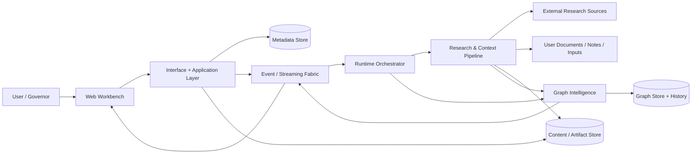
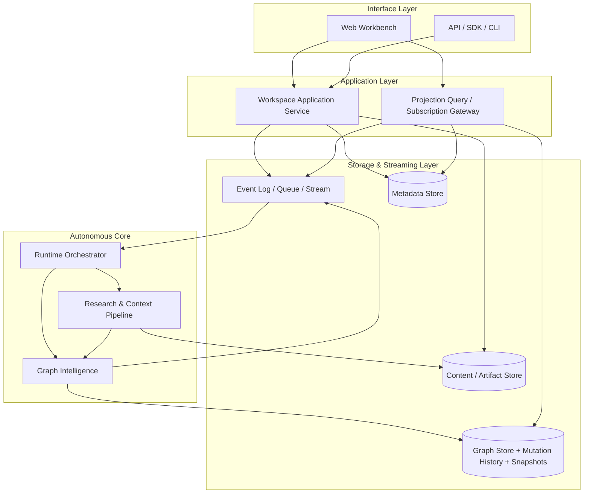
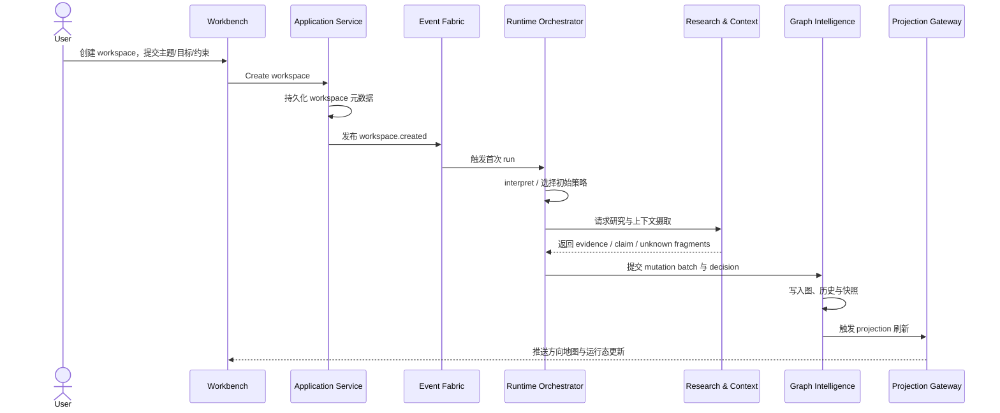
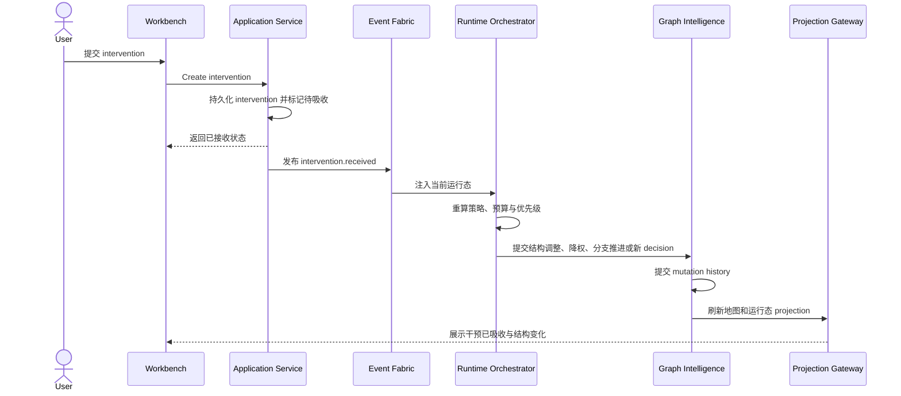
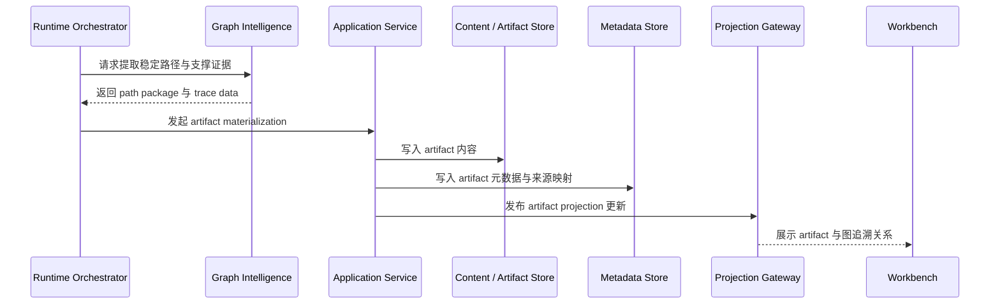

# Idea Factory 系统架构设计文档

> 版本：v1
> 日期：2026-03-14
> 状态：系统架构补充文档

## 1. 文档定位

本文是对《技术设计文档》的系统级补充，回答的问题不是“系统有哪些概念”，而是“这些概念如何落成一个可实现、可演进、可恢复的系统”。

它重点补齐四类内容：

- 顶层系统边界与外部上下文
- 容器级职责拆分与协作关系
- 自治运行、干预吸收和投影刷新的关键时序
- 数据职责、一致性边界与非功能要求

本文不替代产品设计，也不展开到具体代码实现、数据库产品选型或部署厂商选型。

## 2. 架构目标与范围

v1 系统架构必须支撑以下结果：

- 以 `workspace` 为长期存在的顶层容器，而不是一次性会话任务
- 以 `event-driven runtime` 持续推进探索，而不是一次性生成结果
- 以图作为方向结构、证据挂接和系统判断的真相层
- 以前端消费 `projection` 为主，而不是在前端拼装原始图逻辑
- 以 `intervention` 作为实时治理输入，并能被运行时吸收与反映
- 以 mutation 历史、快照和事件日志支撑追溯、恢复与重放

v1 仍然明确不做：

- 强实时多人协作
- 通用图编辑器
- 细粒度图操作 API 作为主交互
- 绑定单一垂直场景的前台主流程

## 3. 系统上下文

这张上下文图表达三个核心关系：

- 用户只直接治理 `workspace` 和其投影，不直接操作底层图 mutation。
- `Runtime`、`Graph Intelligence` 和 `Research & Context` 组成自治推进内核。
- 元数据、图历史、原始内容和事件流分属不同职责面，避免“所有东西都塞进一个库”。

## 4. 容器级架构

### 4.1 Interface Layer

- `Web Workbench` 承载 `workspace` 主界面、方向地图、运行态解释和干预入口。
- `API / SDK / CLI` 提供稳定访问面，但不泄露底层图存储细节。
- 这一层负责表达产品语义，不负责图计算和运行时编排。

### 4.2 Application Layer

- 管理 `workspace` 生命周期、预算、权限、配置和高层接口聚合。
- 接收 `intervention`、触发 `run`、提供 `projection` 查询与订阅入口。
- 这一层负责应用级契约，不负责语义去重、路径评分或研究抽取。

### 4.3 Autonomous Core

- `Runtime Orchestrator` 决定下一步探索策略、调度阶段能力并吸收中途干预。
- `Graph Intelligence` 负责 mutation 提交、结构压缩、方向评分、快照和投影构建。
- `Research & Context Pipeline` 负责把外部研究和用户资料转成可挂接的结构化输入。

### 4.4 Storage & Streaming Layer

- `Metadata Store` 保存 `workspace`、`run`、`intervention`、`artifact` 等元数据。
- `Graph Store` 保存节点、边、`decision`、`evidence` 挂接、mutation 历史和快照。
- `Content / Artifact Store` 保存原始文档、切片、中间资料和已物化结果。
- `Event Log / Queue / Stream` 负责异步推进、恢复、重试和前端流式同步。

## 5. 核心子系统职责边界

| 子系统 | 主要输入 | 主要输出 | 负责 | 不负责 |
| --- | --- | --- | --- | --- |
| Workspace Application Service | 用户请求、预算配置、身份权限 | `workspace` 元数据、`run` 触发、`intervention` 记录 | 顶层契约与生命周期管理 | 图语义计算、研究抽取 |
| Runtime Orchestrator | 事件流、当前策略、预算、干预 | 阶段执行请求、mutation proposal、下一步策略 | 自治推进、阶段切换、失败恢复、干预吸收 | 对外读取模型、前端展示拼装 |
| Graph Intelligence | mutation proposal、研究片段、历史状态 | 图提交结果、评分、快照、`projection` 刷新信号 | 图真相层维护、去重、聚类、追溯、投影构建 | 直接调度外部研究源 |
| Research & Context Pipeline | 外部资料、用户文档、网页、临时输入 | `evidence` / `claim` / `unknown` 片段与挂接建议 | 来源登记、归一化、切片、抽取、语义挂接准备 | 主界面状态管理、运行策略决策 |
| Projection Query / Subscription | 图快照、mutation 历史、元数据、事件 | 地图、路径、运行态、artifact 等读取面 | 稳定读取契约、增量推送 | 反向替代图真相层 |

这里最重要的边界是：

- 写路径以 `Runtime -> Graph Intelligence` 为中心。
- 读路径以 `Projection Query / Subscription` 为中心。
- `Application Layer` 负责契约聚合，不直接承担智能层职责。

## 6. 关键时序

### 6.1 `workspace` 创建后的首次自治推进

### 6.2 `intervention` 被吸收并重排后续策略

### 6.3 从稳定方向物化 `artifact`

这些时序强调的不是某个函数调用顺序，而是三个系统级约束：

- 所有外部输入都先变成显式对象或事件，再进入运行时。
- 图更新必须先于主投影刷新，避免 UI 领先于真相层。
- `artifact` 是派生物，不反向替代图和历史记录。

## 7. 数据职责与一致性模型

| 数据面 | 保存内容 | 写入主体 | 读取主体 | 一致性要求 |
| --- | --- | --- | --- | --- |
| 元数据面 | `workspace`、`run`、`intervention`、`artifact` | Application Layer | Application Layer、Projection Layer | 面向业务对象的一致更新与状态可见性 |
| 图真相层 | 节点、边、`decision`、`evidence` 挂接、路径关系 | Graph Intelligence | Projection Layer、调试/分析入口 | 以 mutation 批次为边界，保证相关结构一起提交 |
| 历史与快照层 | mutation history、snapshot、branch/path tracking | Graph Intelligence | Projection 重建、重放、审计 | 可重放、可追溯、可从稳定版本重建 |
| 内容层 | 原始文档、网页抓取、切片、artifact 内容 | Research Pipeline、Application Layer | Research Pipeline、Artifact 读取面 | 原文保留与来源映射完整 |
| 事件流层 | 生命周期事件、运行事件、刷新信号 | Application Layer、Graph Intelligence | Runtime、Projection Gateway、运维观察 | 事件可重试、可恢复，处理逻辑应尽量幂等 |

在这套模型中：

- `Graph is the source of truth` 只针对方向结构、证据挂接和系统判断成立。
- `Projection` 是读取优化层，不承担真相层职责，理论上应始终可重建。
- 元数据面和图真相层可以分开存储，但它们之间的引用关系必须稳定。

## 8. 非功能要求与运行约束

### 8.1 可追溯

- 任一高价值方向都应追溯到对应 `run`、`decision`、`evidence` 和 mutation 历史。
- 任一 `intervention` 都应能回答“是否已吸收、何时吸收、改变了什么”。

### 8.2 可恢复

- `Runtime` 中断后应能基于事件日志、`run` 状态和图快照恢复。
- 单次研究失败不应破坏已提交的稳定图状态。

### 8.3 可重放

- 系统应支持基于 mutation history 重建某一版本地图。
- `projection` 刷新失败时，应能从图和元数据重新生成，而不是依赖前端缓存。

### 8.4 长时运行与失败隔离

- 运行时应允许 `workspace` 在长期存在的前提下反复推进多个 `run`。
- 研究任务、图提交、artifact 物化应有清晰隔离，避免单点失败拖垮整个自治循环。

### 8.5 流式同步与可观测性

- 前端看到的应是节点级变化和运行态变化，而不是整图整页刷新。
- 至少需要围绕事件处理、mutation 提交、投影重建和失败重试建立日志与指标。

## 9. v1 工程拆分建议

为了降低耦合并让后续实现能并行推进，建议按以下边界拆分工程工作：

1. `Workspace + Intervention Application Service`
2. `Runtime Orchestrator + Event Handling`
3. `Graph Intelligence + History + Projection Builder`
4. `Research & Context Ingestion`
5. `Artifact Materialization + Traceability`

这个拆分不是发布顺序，但它明确了后续实现应围绕哪些系统边界建模块，而不是直接围绕页面或单个接口堆逻辑。

## 10. 一句话总结

`Idea Factory` 的 v1 系统架构应被实现为一个以 `workspace` 为顶层契约、以 `event-driven runtime` 为推进引擎、以图为真相层、以 `projection` 为产品读取面、以 `intervention` 为治理输入的自治探索系统。
