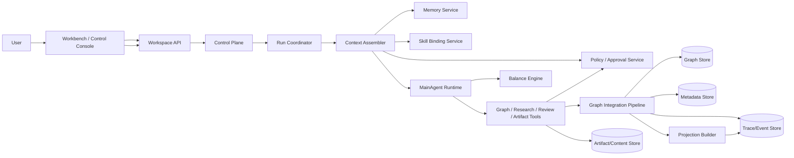

# Idea Factory 系统架构设计文档（Target State）

> 版本：v1.1-target
> 日期：2026-04-19
> 状态：目标态系统架构规范

## 1. 文档职责与边界

本文件定义系统层问题：

- 子系统职责边界与调用关系
- 控制面、执行协议层、长期能力层的协作方式
- 数据面与一致性模型
- 非功能要求与运行约束
- 工程拆分与演进路径

本文件不定义：

- 产品交互目标（见产品设计）
- 领域状态机细节与业务规则（见技术设计）

## 2. 系统上下文

## 3. 参考模式映射到系统分层

吸收三类外部模式后，推荐把系统分成三层：

### 3.1 控制面（更像 Claude Code）

职责：

- 提供显式治理入口，如 `pause / resume / redirect / review / artifact`
- 提供运行状态、等待原因、checkpoint、最近治理动作的统一视图
- 把用户对自治系统的控制从自由文本中抽出来，变成结构化动作

### 3.2 执行协议层（更像 Codex）

职责：

- 管理 `run / turn / checkpoint / approval / trace`
- 让所有高影响动作落到统一工具面和统一事件流中
- 保证恢复、中断、失败、继续时语义清晰

### 3.3 长期能力层（更像 Hermes）

职责：

- 管理 `workspace memory`、`user preference memory`、`skill binding`
- 提供跨 run 上下文召回、异步预取和可选 specialist 协作
- 保证同一个 workspace 越跑越懂用户和主题，而不是反复重来

## 4. 子系统职责边界

| 子系统 | 输入 | 输出 | 负责 | 不负责 |
| --- | --- | --- | --- | --- |
| Workspace API | 用户请求、权限、预算 | workspace/run/control action API 响应 | 顶层业务契约与鉴权 | 内部 graph 生长决策 |
| Control Plane | 控制动作、UI 命令、策略调整 | 结构化 `control_action` | 控制动作统一建模、分发与可见性 | 直接修改 graph |
| Run Coordinator | 启动信号、control action、调度事件 | run 生命周期驱动 | run 创建、状态推进、恢复入口 | 决定新增哪些节点边 |
| Context Assembler | workspace、graph、memory、skills、policy | `MainAgent` 运行上下文 | 统一装配执行上下文 | 决定探索策略 |
| MainAgent Runtime | graph、memory、skills、policy、balance | 工具调用 | graph 生长、研究/审查/产出决策 | 绕过工具直接写库 |
| Balance Engine | 历史轨迹、当前图信号 | balance 建议 | 节奏调节策略 | 直接生成 graph mutation |
| Memory Service | turn 摘要、显式 pin、长期结论 | memory recall / writeback | 长期记忆提炼与召回 | 直接决定 run 行为 |
| Skill Binding Service | workspace、任务模式、artifact 类型 | skill bindings | 按需装载技能与模板 | 直接落库 graph |
| Policy / Approval Service | tool request、workspace policy | allow/deny/review decision | 风险分级、审批、治理约束 | 决定 graph 内容 |
| Tool Surface | Agent 工具调用请求 | 结构化工具结果 | 参数解码、权限边界、结果标准化 | 替 Agent 做 graph 策略判断 |
| Graph Integration Pipeline | `append_graph_batch` 等结构化请求 | graph delta、mutation、持久化结果 | 最小校验、事务提交、事件生成、广播 | 自主决定 graph 生长方向 |
| Projection Builder | graph delta、metadata、trace | projection/event | 只读投影构建与推送 | 反向修改 graph |

## 5. 数据职责与一致性

| 数据面 | 保存内容 | 写入者 | 一致性要求 |
| --- | --- | --- | --- |
| Metadata | workspace/run/turn/control action/policy 最小运行摘要 | API + Runtime | 状态转移必须单调可追溯 |
| Graph | direction / evidence / claim / decision / unknown / artifact 节点及关系边 | Graph Integration Pipeline | 只接受结构化批量追加 |
| Trace/Event | run、turn、tool、approval、mutation、projection、control action 事件 | Runtime + Control Plane + Integration + Projection | 事件幂等、可补拉 |
| Artifact/Content | 原始资料、外部内容、物化产物 | Tool Surface / MainAgent | 保留来源映射与版本 |
| Memory | workspace memory、user preference memory、working memory 摘要 | Memory Service | 写入需可归因到 run/turn 或用户动作 |
| Skill Registry | 可绑定技能、workspace 绑定关系、激活条件 | Skill Binding Service | 技能版本与绑定状态可追溯 |

一致性原则：

- `Graph` 与 `Metadata` 通过 `run + turn` 边界关联，避免“孤儿投影”
- `Projection` 可由 `Graph + Metadata + Trace` 重建
- 控制动作对系统的影响必须能在 `Trace` 与 `Projection` 中找到对应映射
- 事件流采用至少一次投递，客户端基于事件 ID 去重

Graph 写入约束：

- 所有 graph 写入必须通过统一 graph tool 进入 Integration Pipeline
- 当前只允许追加，不允许程序侧整图替换或硬删除
- 一次 graph tool 调用内的 nodes / edges 必须原子提交
- graph mutation 必须绑定 `workspace_id + run_id + turn_id + actor`

## 6. 关键时序（系统层）

### 6.1 首次 Run

1. API 创建 workspace 并触发 run
2. Control Plane 初始化默认 policy、charter 与 seed control context
3. Coordinator 初始化运行上下文并登记 run
4. Context Assembler 装载 graph、memory、skills、policy、recent control actions
5. MainAgent 开始首个 turn，按需调用 `append_graph_batch`、research、review、artifact 等工具
6. Integration 写入 graph / mutations / trace，Projection 刷新并推送事件
7. Coordinator 判断是否进入下一 turn 或完成 run

### 6.2 Intervention / Review / Artifact Request

1. API 写入 `control_action`（`received`）
2. Control Plane 将其分类为 intervention、review request、artifact request 或 policy adjustment
3. Coordinator 将该动作注入当前或下一轮 run 上下文
4. MainAgent 在后续 turn 中改变探索重心、触发审查或发起产物物化
5. Projection 输出该动作的影响摘要（`reflected`）

### 6.3 Resume From Checkpoint

1. 用户在控制台选择 checkpoint 或最新稳定状态
2. API 创建 `resume_request`
3. Coordinator 基于 checkpoint 恢复 run context
4. Context Assembler 重新装载当时 graph 状态、关键 memory 与后续新增控制动作
5. MainAgent 从新的 turn 继续推进

### 6.4 自动调度与恢复

1. Run 正常结束后，Coordinator 根据 workspace 状态、policy 与增量价值判断是否调度下一轮
2. `paused` 状态阻止下一轮调度，但不强杀当前 run
3. 服务重启后，active workspace 恢复调度能力，由新 run 从最近 checkpoint 继续

## 7. Specialist / Subagent 位置

系统允许后续引入 specialist，但不把它作为默认前提。

推荐仅在以下场景使用：

- 并行研究
- 专项 review
- artifact 物化

架构约束：

- specialist 默认不拥有 graph 直写特权
- specialist 输出必须经 `MainAgent` 回收或通过受控 tool 提交
- 不允许 specialist 绕过 policy / approval service

## 8. 非功能要求

- 可追溯：任一高价值方向能回溯到 `run / turn / tool / mutation / control_action`
- 可恢复：进程中断后可从最近一致状态和 checkpoint 恢复运行
- 可观测：run、turn、tool、projection、approval、error 六类指标必须可采集
- 失败隔离：单个 tool、review worker 或 artifact worker 失败不应导致整个系统不可解释
- 安全边界：模型只能通过受控工具层访问 graph、外部研究与产出能力
- 长期连续性：memory 与 skills 必须可跨 run 生效且可归因

## 9. 工程拆分建议（按子系统）

1. Workspace API + Control Plane
2. Run Coordinator + Turn Runtime
3. Context Assembler + Memory Service + Skill Binding Service
4. Tool Surface + Policy / Approval Service
5. Graph Integration + Mutation/Event Pipeline
6. Projection Builder + Client Sync

## 10. 与技术文档和接口文档的关系

- 状态机、领域语义、graph mutation 语义：见技术设计
- 具体 HTTP schema 与错误码：见 OpenAPI

引用：

- [idea-factory-technical-design.md](./idea-factory-technical-design.md)
- [idea-factory-openapi.yaml](./idea-factory-openapi.yaml)

## 11. 一句话总结

系统架构的核心，不再只是一个“薄协调器 + MainAgent”，而是一个由 `控制面 + 执行协议层 + 长期能力层` 共同支撑的 graph-first exploration runtime。
