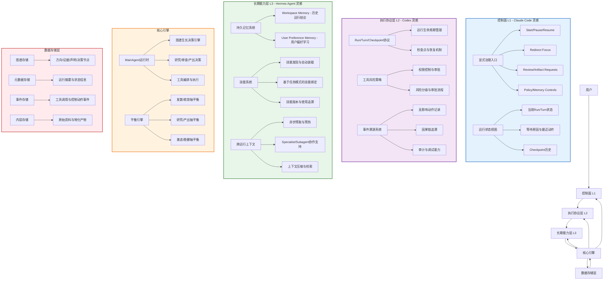
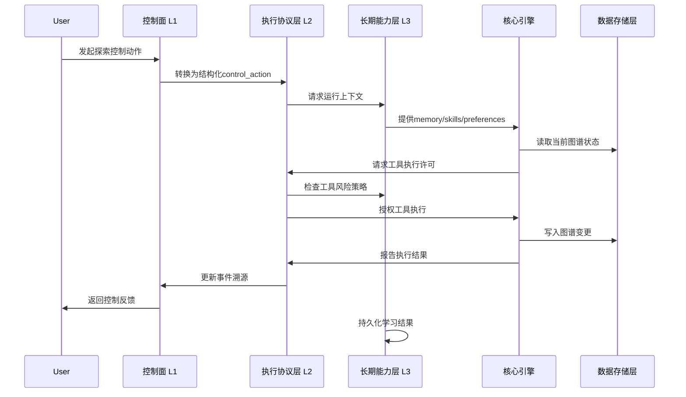
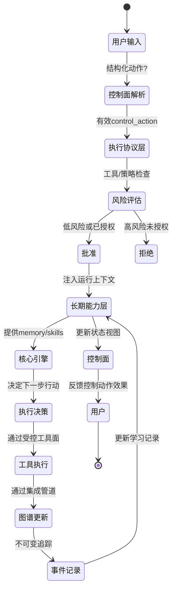

# Idea Factory 三层架构图解

## 整体架构

## 数据流示例

## 控制动作生命周期

## 三层职责清晰度原则

1. **控制面 (L1)** 只负责：
   - 用户输入的结构化转换
   - 治理动作的分发与可见性
   - 运行状态的统一呈现
   - 不直接修改图谱或执行工具

2. **执行协议层 (L2)** 只负责：
   - 运行生命周期管理 (run/turn/checkpoint)
   - 工具调用的权限控制与审批
   - 所有高影响动作的不可变追踪
   - 不做图谱生长决策或长期记忆管理

3. **长期能力层 (L3)** 只负责：
   - 持久记忆的存储与检索
   - 技能的发现、绑定与应用
   - 用户偏好的学习与应用
   - 跨运行上下文的维护
   - 不直接控制执行或修改图谱

4. **核心引擎** 只负责：
   - 在三层约束下进行图谱生长决策
   - 研究/审查/产出的执行决策
   - 工具的编排与实际调用
   - 平衡引擎的行为轴调节

5. **数据存储层** 只负责：
   - 持久化存储与检索
   - 数据完整性与一致性
   - 不包含任何业务逻辑